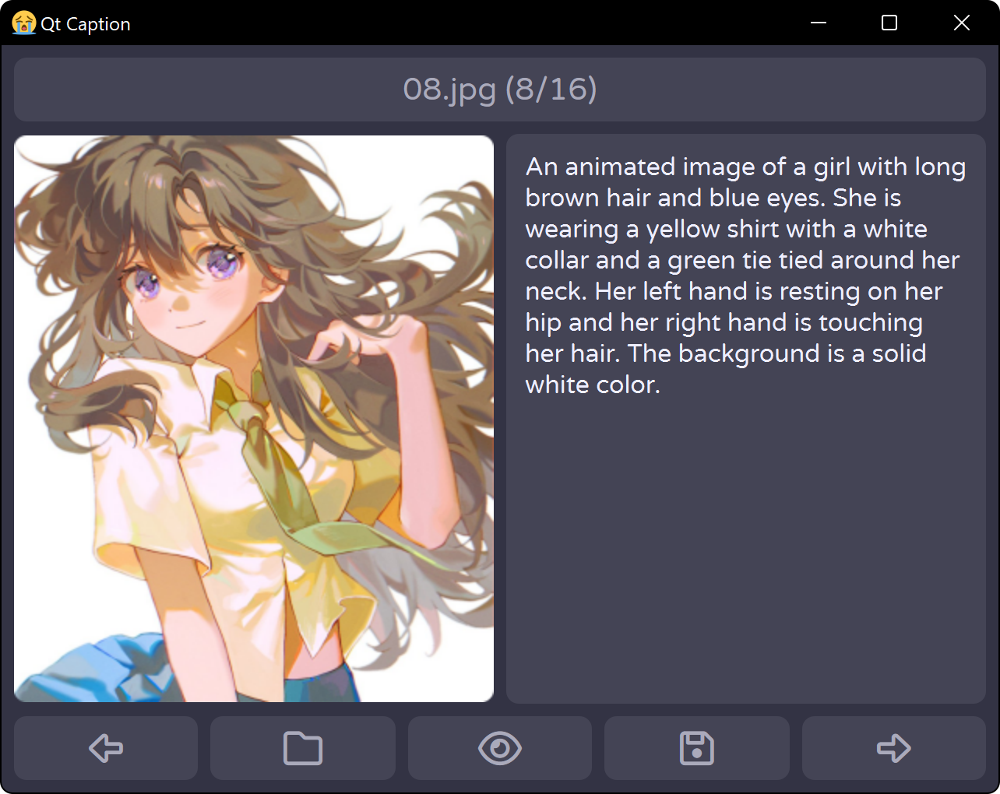

# Qt Caption
A simple image captioning GUI using [Florence-2](https://huggingface.co/collections/microsoft/florence-6669f44df0d87d9c3bfb76de).

## Installation
Create a new environment with mamba:
```
mamba create -n qt-caption git python pytorch pytorch-cuda -c conda-forge -c nvidia -c pytorch
mamba activate qt-caption
```

Clone the repository and install requirements:
```
git clone https://github.com/zuellni/qt-caption
pip install -r qt-caption/requirements.txt
```

## Usage
Start the GUI with:
```
python qt-caption
```

Or with a script like this to hide the console:
```bat
@echo off
call mamba activate qt-caption
start pythonw qt-caption
```

## Preview

